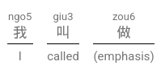

# Notes for Cantonese

## Helpful

It may be helpful to install the [Inject Jyutping](https://github.com/CanCLID/inject-jyutping) extension. Depending on the type of browser you're using, you may use the appropriate extension to see the Jyutping on the text.

-   [Chrome Web Store](https://chrome.google.com/webstore/detail/inject-jyutping/lfgpgjkjglogbndlkikjgbbfoiofbdjp)
-   [Firefox Browser Add-On](https://addons.mozilla.org/firefox/addon/inject-jyutping/)

## Description

I'm pretty much just putting dialogs from episodes or other notes.

## Note Blocks

You may add note blocks via

```
::: underbrace
我 | I
叫 | called
做 | (emphasis)
:::
```

which will be rendered as 



## Tools Used

For this repository, I'm using [MkDocs](https://www.mkdocs.org/) to render the information in the Markdown files. I'm using the [Material](https://squidfunk.github.io/mkdocs-material/) theme.
